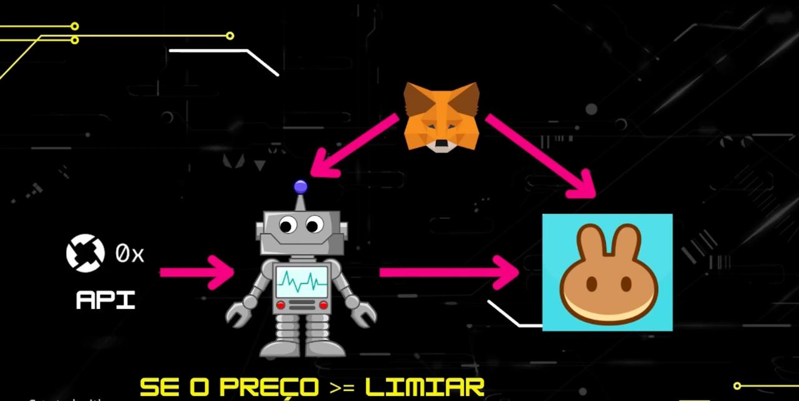

# bot_trader_pancakeswap
BOT TRADER de Tokens para PANCAKESWAP

## Dependencias

```
pip install web3
```

## PancakeRouter 

```
https://testnet.bscscan.com/address/0x9Ac64Cc6e4415144C455BD8E4837Fea55603e5c3#code
```

> Doc

https://docs.pancakeswap.finance/developers/smart-contracts/pancakeswap-exchange/v2-contracts/router-v2?utm_source=chatgpt.com

## WBNB Token

```
https://testnet.bscscan.com/address/0xae13d989dac2f0debff460ac112a837c89baa7cd#code
```

## CAKE Token

```
https://testnet.bscscan.com/address/0xfa60d973f7642b748046464e165a65b7323b0dee#code
```
---

Exemplo de transação com erro (execução pelo py): https://testnet.bscscan.com/tx/0xfff6a9b713291032d5b859bf3304b11383ed16fd452931be2c1f6e6923dd652d


Exemplo de transação com sucesso (execução pela UI): https://testnet.bscscan.com/tx/0x2177e01dc8589b6a3573a007e65433670e672fe1692abddc468dc2abd3bb10a1
---

# Bot Trader de Tokens para PancakeSwap

Este projeto é um bot trader de tokens na PancakeSwap, utilizando a rede de teste da Binance Smart Chain (BSC Testnet).  
Ele foi baseado na aula do Professor Fábio Santos, que aborda conceitos de programação em Python, contratos inteligentes (smart contracts) e integrações com bibliotecas Web3.

[Video](https://youtu.be/NFAzz-kX3Z4?si=WJiBLGWRgiBmSO2A)

# Arquitetura



## Objetivos

1. Um bot capaz de realizar “swaps” (compra e venda) de tokens na PancakeSwap.  
2. Configurar o bot usando Python, integrando-o com o MetaMask e a rede BSC Testnet.  
3. Fornecer uma visão de como automatizar transações de compra e venda de tokens com base em um critério simples (por exemplo, preço mínimo ou máximo).  
4. Servir como referência para estudos de programação em Solidity, Web3 e automação de trades em ambientes de teste.

## Avisos Importantes

- Este bot é estritamente para fins de ensino e aprendizagem, não devendo ser utilizado em ambiente de produção ou com fins financeiros sem o devido conhecimento de riscos.  
- Criptomoedas são ativos de alto risco. Qualquer uso deste código em ambientes reais é de sua total responsabilidade.  
- Nunca compartilhe sua chave privada com terceiros.  
- O autor do conteúdo e os contribuidores deste repositório não se responsabilizam por perdas financeiras ou uso indevido do código.

## Como Funciona

1. O bot conecta-se a um nó (full node) na BSC Testnet por meio da biblioteca Web3.py.  
2. Ele obtém o valor do token alvo em dólares utilizando a API do 0x (ou outra API de preço).  
3. Caso o preço atual do token esteja acima de um determinado limite (threshold), o bot:  
   - Realiza a aprovação (approve) para o contrato de roteamento da PancakeSwap poder movimentar seus tokens.  
   - Executa a função de troca (swap) do token específico (por exemplo, WBNB) para outro token (por exemplo, CAKE).  
4. O processo se repete continuamente, checando periodicamente o preço e tomando ações de compra ou venda conforme configurado.  
5. Todas as transações exigem BNB para cobrir taxas de rede, então certifique-se de ter saldo suficiente em BNB (faucet) na carteira MetaMask configurada no modo de teste.  

## Estrutura do Projeto

- <strong>bot_trader.py</strong> – Arquivo principal contendo o código do bot. É onde ficam:  
  - Conexão com a rede BSC Testnet.  
  - Funções para consultar preço via API.  
  - Funções para aprovar e executar o swap de tokens.  
  - Loop principal que verifica o preço e decide a operação de compra ou venda.  

- <strong>contracts/</strong> (opcional) – Pasta para armazenar ABIs (Interfaces de Contratos Inteligentes) necessários, caso separados do código principal.  

- <strong>requirements.txt</strong> (opcional) – Lista de dependências Python necessárias para o projeto.  

## Pré-Requisitos

1. Python 3 instalado em seu sistema.  
2. MetaMask instalado em seu navegador, configurado para a BSC Testnet.  
3. BNB na rede de teste (BSC Testnet) para cobrir taxas de transação (use um faucet).  
4. Acesso a um nó da BSC Testnet – neste projeto geralmente utilizamos um endpoint público ou um provedor compatível (por exemplo, node do Alchemy, Ankr etc. se suportarem BSC).  
5. Bibliotecas Python necessárias (por exemplo, web3, requests/asyncio/axios-like, dependendo do que preferir), mencionadas no requirements.txt ou instaladas manualmente.

## Instalação

1. Clone este repositório:  
   git clone https://github.com/SEU_USUARIO/BotTraderPancake.git

2. Acesse a pasta do projeto:  
   cd BotTraderPancake

3. (Opcional) Crie um ambiente virtual e ative-o:  
   python -m venv venv  
   source venv/bin/activate  (Linux/Mac)  
   venv\Scripts\activate.bat (Windows)

4. Instale as dependências (se estiver usando um requirements.txt):  
   pip install -r requirements.txt

5. Configure as variáveis de ambiente ou edite o arquivo de configuração (caso exista) para informar:  
   - ENDEREÇO DA SUA CARTEIRA (PUBLIC ADDRESS)  
   - CHAVE PRIVADA (ou via arquivo de variáveis de ambiente)  
   - ENDEREÇOS dos contratos do token que deseja negociar e do roteador da PancakeSwap (testnet).  

## Uso

1. Antes de tudo, adicione BNB de teste à sua conta MetaMask através de um faucet, garantindo que exista saldo para pagar taxas.  
2. Ajuste parâmetros como "limiar de preço", quantidade de tokens, intervalos de checagem etc. no arquivo bot_trader.py.  
3. Execute o bot:  
   python bot_trader.py  

4. O bot iniciará um loop infinito, monitorando o preço do token. Caso o preço atinja o limiar definido, ele executará as transações de aprovação e swap.

## Estratégia de Investimento

O bot implementa uma estratégia de negociação (“trading”) simples, do tipo “buy low, sell high” (comprar barato, vender caro), baseada em limiares (thresholds) de preço. A mecânica funciona da seguinte forma:

1. Definimos dois parâmetros no código:  
   - SELL_THRESHOLD (limiar de venda) → Se o preço do token ultrapassar esse valor, o bot considera que está “caro” e vende.  
   - BUY_THRESHOLD (limiar de compra) → Se o preço do token cair abaixo desse valor, o bot considera que está “barato” e compra.

2. Durante o loop principal, o bot consulta continuamente o preço do par de tokens (por exemplo, WBNB ↔ CAKE) utilizando a API do 0x.  
   - Através dos valores de “buyAmount” e “sellAmount” retornados, calcula qual é o preço atual desse par.  

3. Em cada iteração, o bot compara o preço atual com os limiares de compra e venda.  
   - Se price ≥ SELL_THRESHOLD, ele executa uma transação de venda do token em uso (por exemplo, vende WBNB para obter CAKE).  
   - Se price ≤ BUY_THRESHOLD, ele executa uma transação de compra (por exemplo, compra WBNB usando CAKE).  
   - Caso o preço não atinja nenhum dos limiares, o bot não faz nada e apenas aguarda até a próxima checagem.  

4. Como se trata de uma estratégia extremamente simples, não há análise de volume, indicadores técnicos avançados, ou notícias de mercado. Portanto, é recomendada apenas para fins educacionais e de teste. No ambiente real, esse tipo de abordagem pode não ser suficiente, dada a volatilidade do mercado cripto.

5. Você pode ajustar os valores de SELL_THRESHOLD e BUY_THRESHOLD conforme sua preferência ou testar diferentes estratégias (por exemplo, incluir análise de indicadores técnicos, médias móveis, bandas de Bollinger etc.) para aprimorar a tomada de decisão do bot.

## Consulta e Cálculo de Preço (API 0x)

Nesta seção, explicamos como o bot obtém o preço de um token por meio da API do 0x, como calculamos a cotação entre WBNB e CAKE, e como definimos o limiar (“linear”) de compra ou de venda.

-------------------------------------------------------------------------------
### 1. Consulta do Preço via API 0x
-------------------------------------------------------------------------------

O fluxo começa com uma requisição HTTP para a URL da API 0x, passando parâmetros como:  
- chainId: Identificador da rede (por ex., 1 = Ethereum Mainnet, 56 = BSC, etc.)  
- sellToken: Endereço do token que você está “vendendo” (por exemplo, WBNB).  
- buyToken: Endereço do token que você está “comprando” (por exemplo, CAKE).  
- sellAmount: Quantidade (em unidades mínimas) do token de venda.  
- Outros parâmetros opcionais (taker, slippageBps, etc.).

Exemplo (ficcional) para WBNB → CAKE na BSC Testnet:

```
curl -X 'GET' \
  'https://api.0x.org/swap/permit2/price?chainId=56&sellToken=<WBNB_ADDRESS>&buyToken=<CAKE_ADDRESS>&sellAmount=1000000000000000000' \
  -H 'accept: application/json' \
  -H '0x-api-key: SEU_API_KEY_AQUI' \
  -H '0x-version: v2'
```

Chamada real:

```
curl -X 'GET' \
  'https://api.0x.org/swap/permit2/price?chainId=56&buyToken=0x0e09fabb73bd3ade0a17ecc321fd13a19e81ce82&sellToken=0xbb4CdB9CBd36B01bD1cBaEBF2De08d9173bc095c&sellAmount=100000000&taker=0x70a9f34f9b34c64957b9c401a97bfed35b95049e&slippageBps=100&sellEntireBalance=false' \
  -H 'accept: application/json' \
  -H '0x-api-key: SEU_API_KEY_AQUI' \
  -H '0x-version: v2'
````

<details>
  <summary>Response</summary>
  ```
{
  "blockNumber": "47089071",
  "buyAmount": "31363692677",
  "buyToken": "0x0e09fabb73bd3ade0a17ecc321fd13a19e81ce82",
  "fees": {
    "integratorFee": null,
    "zeroExFee": {
      "amount": "150000",
      "token": "0xbb4cdb9cbd36b01bd1cbaebf2de08d9173bc095c",
      "type": "volume"
    },
    "gasFee": null
  },
  "gas": "1017825",
  "gasPrice": "1000000000",
  "issues": {
    "allowance": {
      "actual": "0",
      "spender": "0x000000000022d473030f116ddee9f6b43ac78ba3"
    },
    "balance": {
      "token": "0xbb4cdb9cbd36b01bd1cbaebf2de08d9173bc095c",
      "actual": "0",
      "expected": "100000000"
    },
    "simulationIncomplete": false,
    "invalidSourcesPassed": []
  },
  "liquidityAvailable": true,
  "minBuyAmount": "31050053100",
  "route": {
    "fills": [
      {
        "from": "0xbb4cdb9cbd36b01bd1cbaebf2de08d9173bc095c",
        "to": "0x55d398326f99059ff775485246999027b3197955",
        "source": "Uniswap_V4",
        "proportionBps": "9993"
      },
      {
        "from": "0xbb4cdb9cbd36b01bd1cbaebf2de08d9173bc095c",
        "to": "0x8ac76a51cc950d9822d68b83fe1ad97b32cd580d",
        "source": "PancakeSwap_V3",
        "proportionBps": "7"
      },
      {
        "from": "0x55d398326f99059ff775485246999027b3197955",
        "to": "0x8ac76a51cc950d9822d68b83fe1ad97b32cd580d",
        "source": "Uniswap_V4",
        "proportionBps": "5759"
      },
      {
        "from": "0x55d398326f99059ff775485246999027b3197955",
        "to": "0x8ac76a51cc950d9822d68b83fe1ad97b32cd580d",
        "source": "Maverick",
        "proportionBps": "4234"
      },
      {
        "from": "0x8ac76a51cc950d9822d68b83fe1ad97b32cd580d",
        "to": "0x2170ed0880ac9a755fd29b2688956bd959f933f8",
        "source": "Thena",
        "proportionBps": "10000"
      },
      {
        "from": "0x2170ed0880ac9a755fd29b2688956bd959f933f8",
        "to": "0xe9e7cea3dedca5984780bafc599bd69add087d56",
        "source": "ApeSwap",
        "proportionBps": "10000"
      },
      {
        "from": "0xe9e7cea3dedca5984780bafc599bd69add087d56",
        "to": "0x0e09fabb73bd3ade0a17ecc321fd13a19e81ce82",
        "source": "SushiSwap",
        "proportionBps": "10000"
      }
    ],
    "tokens": [
      {
        "address": "0xbb4cdb9cbd36b01bd1cbaebf2de08d9173bc095c",
        "symbol": "WBNB"
      },
      {
        "address": "0x55d398326f99059ff775485246999027b3197955",
        "symbol": "USDT"
      },
      {
        "address": "0x8ac76a51cc950d9822d68b83fe1ad97b32cd580d",
        "symbol": "USDC"
      },
      {
        "address": "0x2170ed0880ac9a755fd29b2688956bd959f933f8",
        "symbol": "ETH"
      },
      {
        "address": "0xe9e7cea3dedca5984780bafc599bd69add087d56",
        "symbol": "BUSD"
      },
      {
        "address": "0x0e09fabb73bd3ade0a17ecc321fd13a19e81ce82",
        "symbol": "Cake"
      }
    ]
  },
  "sellAmount": "100000000",
  "sellToken": "0xbb4cdb9cbd36b01bd1cbaebf2de08d9173bc095c",
  "tokenMetadata": {
    "buyToken": {
      "buyTaxBps": "0",
      "sellTaxBps": "0"
    },
    "sellToken": {
      "buyTaxBps": "0",
      "sellTaxBps": "0"
    }
  },
  "totalNetworkFee": "1017825000000000",
  "zid": "0x365883c255a225167c5fae25"
}
```
</details>


Neste exemplo:
- “sellAmount” = 1000000000000000000 representa 1.0 WBNB (pois WBNB tem 18 casas decimais).  
- A resposta retornará, dentre outros campos, “buyAmount”, indicando quantos CAKE você receberá ao vender 1 WBNB.

-------------------------------------------------------------------------------
### 2. Cálculo do Preço
-------------------------------------------------------------------------------

Para descobrir a taxa de câmbio (quantos CAKE se obtém por cada WBNB vendido), podemos usar:

  
  price = buyAmount / sellAmount
  

Porém, como WBNB e CAKE normalmente têm 18 decimais, precisamos verificar se buyAmount e sellAmount já estão nessas “unidades inteiras” multiplicadas por 10^18. Exemplifiquemos:

- Suponha que a API retorne “sellAmount” = 1000000000000000000 (1 WBNB)  
- Suponha que a API retorne “buyAmount” = 3000000000000000000 (3 CAKE)

Assim:

  
  price = 3000000000000000000 ÷ 1000000000000000000 = 3.0
  

Logo, cada 1 WBNB vale 3 CAKE naquele momento.

-------------------------------------------------------------------------------
### 3. Limiar (Linear) de Compra e Venda
-------------------------------------------------------------------------------

Para que o bot tome decisões automaticamente, definimos um limiar para compra ou para venda, também conhecido como threshold. Exemplos:

1. **Limiar de Venda (Sell Threshold):**  
   - Se o preço calculado (WBNB → CAKE) ultrapassar um valor-alvo, o bot irá vender. Ex.: se price ≥ 3.2, vende WBNB em troca de CAKE.

2. **Limiar de Compra (Buy Threshold):**  
   - Se o preço cair abaixo de um certo valor, o bot poderá recomprar. Ex.: se price ≤ 2.8, compra WBNB pagando CAKE (inversão da lógica).

É comum configurá-los no código:

```python
SELL_THRESHOLD = 3.2   # exemplo de venda se WBNB estiver “caro” em relação a CAKE
BUY_THRESHOLD = 2.8    # exemplo de compra se WBNB estiver “barato”
```

-------------------------------------------------------------------------------
### 4. Fluxo de Dados (gráfico Mermaid)
-------------------------------------------------------------------------------

Abaixo, um diagrama Mermaid ilustrando o fluxo de coleta de preço, cálculo e decisão para WBNB ↔ CAKE:


-------------------------------------------------------------------------------
### 5. Exemplo Prático: WBNB → CAKE
-------------------------------------------------------------------------------

Imagine que você esteja rodando o bot para negociar WBNB ↔ CAKE na BSC Testnet:

1. Você definiu `SELL_THRESHOLD = 3.2`, pois planeja vender WBNB se estiver valendo 3.2 CAKE ou mais.  
2. Faz a requisição à API 0x para vender 1 WBNB (sellAmount = 10^18). Recebe:  
   - "sellAmount" = 1000000000000000000 (1 WBNB)  
   - "buyAmount" = 3000000000000000000 (3 CAKE)  
3. Calcula o preço: 3.0 (3 CAKE por 1 WBNB).  
4. Compara com SELL_THRESHOLD (3.2):  
   - price (3.0) < 3.2. Logo, o bot não vende agora.  
5. Em cada nova iteração do loop, a API 0x é consultada novamente. Se, a certa altura, "buyAmount" vier maior (por exemplo 3200000000000000000, ou 3.2 CAKE), o preço passará a 3.2 e o bot decidirá vender.

Esse mesmo raciocínio pode ser adaptado para comprar WBNB usando CAKE, desde que você ajuste o “sellToken” e “buyToken” correspondentes na requisição e a lógica de thresholds no código.

-------------------------------------------------------------------------------
### Conclusão
-------------------------------------------------------------------------------

Para WBNB e CAKE, ambos normalmente usam 18 casas decimais. Então, após receber “buyAmount” e “sellAmount” da API do 0x, faça:  

  
  (buyAmount / 10^18) ÷ (sellAmount / 10^18)  
  = buyAmount ÷ sellAmount  

Sem ajustes adicionais, desde que as respostas estejam coerentes em 18 decimais. Em seguida, compare o preço calculado (quantos CAKE por 1 WBNB) aos limiares de compra e venda que você mesmo definiu. Se atingir (ou exceder) o valor-alvo, o bot executa a transação (approve + swap). Dessa forma, todo o fluxo de tomada de decisão roda automaticamente no loop principal do bot, monitorando constantemente o valor de mercado do par WBNB/CAKE.

## Personalização

- Adapte o critério de compra/venda para outro token ou par de tokens.  
- Integre outras APIs de preço.  
- Insira lógicas de trading mais complexas (ex.: verificar indicadores de mercado).  
- Ajuste o tratamento de exceções para lidar melhor com erros de rede ou tempo de confirmação de transações.

## Próximos Passos

- Implementar lógica adicional de análise de mercado.  
- Extender o bot para lidar com múltiplos tokens simultaneamente.  
- Melhorar a interface de logs, facilitando o monitoramento em tempo real.  
- Criar dashboards ou integrações com bancos de dados para histórico de transações.

## Licença

Este projeto está disponível sob a licença que você preferir (MIT, Apache, etc.). Verifique o arquivo LICENSE caso exista, ou defina a sua.

## Contribuições

Sinta-se livre para contribuir com melhorias no código, documentação ou testes. Basta abrir issues ou enviar pull requests neste repositório.

## Créditos

- Aula de referência: “Aula 12 - Como criar um BOT TRADER de Tokens para PANCAKESWAP (Parte 1)” do Professor Fábio Santos.  
- E-book do professor Fábio Santos sobre desenvolvimento de contratos inteligentes em Solidity.  
- Comunidade Web3 e open source que disponibiliza bibliotecas e documentação úteis para este tipo de automação.
